# PLAN: Active Resilience System

> **Goal**: Eliminate the "hard refresh" requirement after long idle periods by making the app self-healing across all layers — Auth, Workspace, Sync, Notifications, and Security.

---

## Problem Statement

After long idle periods (screen off, system sleep, tab backgrounded), the Asaas ERP app enters a "zombie state" where:
- Supabase access tokens expire silently (default: 1hr)
- WebSocket connections (Novu, Supabase Realtime) die without detection
- The app UI shows stale data and interactions fail with 401/network errors
- The **only recovery** the user has is a hard refresh (Ctrl+R / F5)

This is unacceptable for an ERP that runs on POS terminals and admin dashboards 12+ hours/day.

---

## Root Cause Analysis

| Layer | Current Behavior | Problem |
|:------|:----------------|:--------|
| **Auth** (`AuthContext.tsx`) | Fetches session once, then passively listens to `onAuthStateChange` | If listener misses a refresh while sleeping, session becomes stale. No `visibilitychange` recovery. |
| **Workspace** (`WorkspaceContext.tsx`) | Fetches features once on mount | Never refreshes. If workspace settings change (e.g., admin locks workspace), the user doesn't see it until hard refresh. |
| **Sync** (`useSyncStatus.ts`) | Manual-only sync, no auto-sync after reconnect | Pending mutations pile up silently. No "wake-up" trigger. |
| **Network** (`useNetworkStatus.ts`) | Has a 30s heartbeat & focus listener | **Only connected to `SyncStatusIndicator`**. Auth, Workspace, and Novu are completely blind to it. |
| **Novu** (`NotificationCenter.tsx`) | NovuProvider mounts once | WebSocket dies silently after idle. No reconnect mechanism. |
| **Encryption** (`encryption.ts`) | Hardcoded AES key `iraqcore-supabase-key` | Not a resilience issue, but a **critical security finding** discovered during this audit. |

### Key Discovery: Duplicate Online Hooks
There are **two separate** online-status hooks that do similar things:
- `src/sync/useOnlineStatus.ts` — Simple `navigator.onLine` + `online/offline` events
- `src/hooks/useNetworkStatus.ts` — Advanced: 30s heartbeat, focus listener, toast notifications

These should be unified into a single source of truth.

---

## Proposed Changes

### Phase 1: Core Resilience Engine (NEW)

#### [NEW] [connectionManager.ts](file:///e:/ERP%20System/Asaas/src/lib/connectionManager.ts)

A centralized, singleton "Connection Manager" that all layers subscribe to. This replaces the scattered, disconnected approach.

**Responsibilities:**
- `visibilitychange` event listener (tab focus/blur)
- `online/offline` event listener
- 30-second heartbeat (when tab is visible)
- Event bus: emits `'wake'`, `'online'`, `'offline'`, `'heartbeat'` events
- Debounced to prevent flip-flopping (300ms debounce on state changes)

**Why centralized?** Currently, `useNetworkStatus` does heartbeat, `useOnlineStatus` does basic detection, and Auth does nothing. A single manager ensures one heartbeat ping, one focus listener, and all layers react consistently.

---

### Phase 2: Auth Layer Hardening

#### [MODIFY] [AuthContext.tsx](file:///e:/ERP%20System/Asaas/src/auth/AuthContext.tsx)

1. **Add `visibilitychange` listener**: When the user returns to the tab/app, immediately call `supabase.auth.getSession()` to verify the token is still valid. If not, attempt `supabase.auth.refreshSession()`.

2. **Add session watchdog timer**: A lightweight `setInterval` (every 5 minutes) that checks if the current session's `expires_at` is within the next 2 minutes. If so, proactively refresh. This catches cases where `autoRefreshToken` missed its window during sleep.

3. **Add "stale session" detection**: If `refreshSession()` fails (e.g., refresh token expired after 7 days), gracefully sign the user out with a toast explaining "Session expired, please sign in again" instead of leaving the app in zombie state.

4. **Recovery Bridge improvement**: The current `asaas_session_recovery` only stores user metadata. Add a `recoveredAt` timestamp so the app can distinguish between "recovered 5 seconds ago" (probably still valid) and "recovered 3 days ago" (definitely stale).

---

### Phase 3: Workspace Layer Hardening

#### [MODIFY] [WorkspaceContext.tsx](file:///e:/ERP%20System/Asaas/src/workspace/WorkspaceContext.tsx)

1. **Subscribe to Connection Manager `'wake'` event**: When the user returns from idle, re-fetch workspace features. This ensures locked-workspace, currency changes, and feature toggles are picked up without hard refresh.

2. **Add Supabase Realtime subscription**: Listen to `workspaces` table changes in real-time via `supabase.channel('workspace-changes').on('postgres_changes', ...)`. This gives instant updates when an admin changes settings from another device.

3. **Stale-while-revalidate pattern**: On wake, show the cached features immediately but silently re-fetch in background. If the fetched data differs, update state seamlessly.

---

### Phase 4: Sync Layer Auto-Recovery

#### [MODIFY] [useSyncStatus.ts](file:///e:/ERP%20System/Asaas/src/sync/useSyncStatus.ts)

1. **Auto-sync on reconnect**: When the Connection Manager emits `'online'` after being `'offline'`, and there are pending mutations, automatically trigger `sync()` after a 3-second delay (to let the network stabilize).

2. **Auto-sync on wake**: When the user returns from idle (tab visible again) and the last sync was more than 10 minutes ago, trigger a background sync.

3. **Exponential backoff on failures**: If sync fails, retry after 5s, 15s, 30s, then stop. Currently, a failed sync just sets state to `'error'` and the user has to manually retry.

---

### Phase 5: Notification Reconnection

#### [MODIFY] [NotificationCenter.tsx](file:///e:/ERP%20System/Asaas/src/ui/components/NotificationCenter.tsx)

1. **Add `key` prop driven by a reconnect counter**: When the Connection Manager detects a `'wake'` or `'online'` event, increment a counter. Pass this counter as the `key` to `NovuProvider`, forcing it to remount and re-establish its WebSocket connection.

2. **Protect against rapid reconnects**: Debounce the counter increment to prevent NovuProvider from remounting multiple times during flaky connections.

---

### Phase 6: Unify Network Hooks

#### [DELETE] [useOnlineStatus.ts](file:///e:/ERP%20System/Asaas/src/sync/useOnlineStatus.ts)

This hook is a simpler duplicate of `useNetworkStatus.ts`. Remove it and update `useSyncStatus.ts` to use `useNetworkStatus` instead.

#### [MODIFY] [useNetworkStatus.ts](file:///e:/ERP%20System/Asaas/src/hooks/useNetworkStatus.ts)

- Refactor to use the centralized Connection Manager instead of its own listeners
- Keep the toast notification behavior
- Export both `isOnline` boolean and the full status object for different consumers

#### [MODIFY] [useSyncStatus.ts](file:///e:/ERP%20System/Asaas/src/sync/useSyncStatus.ts)

- Replace `import { useOnlineStatus } from './useOnlineStatus'` with `import { useNetworkStatus } from '@/hooks/useNetworkStatus'`
- Adapt to the slightly different return signature

---

### Phase 7: Security Fix (Bonus — Found During Audit)

> [!CAUTION]
> The encryption key `iraqcore-supabase-key` is hardcoded in `encryption.ts`. This is a **critical security vulnerability** — anyone who reads the source code can decrypt all stored sessions. This should be moved to an environment variable.

#### [MODIFY] [encryption.ts](file:///e:/ERP%20System/Asaas/src/lib/encryption.ts)

- Change `const KEY = 'iraqcore-supabase-key'` to read from `import.meta.env.VITE_ENCRYPTION_KEY` with the hardcoded value as a fallback for backwards compatibility.
- Add the key to `.env.example`.

---

## Architecture Diagram

```mermaid
graph TD
    CM["🔌 Connection Manager<br/>(Singleton)"]
    VIS["visibilitychange"]
    ONL["online / offline"]
    HB["30s Heartbeat"]
    
    VIS --> CM
    ONL --> CM
    HB --> CM
    
    CM -->|"wake event"| AUTH["🔐 AuthContext<br/>Token Refresh"]
    CM -->|"wake event"| WS["🏢 WorkspaceContext<br/>Feature Re-fetch"]
    CM -->|"online event"| SYNC["🔄 SyncEngine<br/>Auto-Sync"]
    CM -->|"wake event"| NOVU["🔔 NovuProvider<br/>Reconnect"]
    CM -->|"status"| NET["📡 useNetworkStatus<br/>UI Indicator"]
    
    AUTH -->|"session valid?"| APP["✅ App Continues"]
    AUTH -->|"session dead"| LOGOUT["🚪 Graceful Logout + Toast"]
```



---

## File Impact Summary

| File | Action | Risk |
|:-----|:-------|:-----|
| `src/lib/connectionManager.ts` | **NEW** | Low — New file, no existing code affected |
| `src/auth/AuthContext.tsx` | **MODIFY** | Medium — Core auth logic, needs careful testing |
| `src/workspace/WorkspaceContext.tsx` | **MODIFY** | Low — Adding subscription, existing logic untouched |
| `src/sync/useSyncStatus.ts` | **MODIFY** | Low — Adding auto-sync triggers |
| `src/ui/components/NotificationCenter.tsx` | **MODIFY** | Low — Adding key-based remount |
| `src/hooks/useNetworkStatus.ts` | **MODIFY** | Low — Refactor to use Connection Manager |
| `src/sync/useOnlineStatus.ts` | **DELETE** | Low — Replaced by unified hook |
| `src/lib/encryption.ts` | **MODIFY** | Medium — Security change, needs migration thought |
| `.env.example` | **MODIFY** | Low — Add new env variable |

---

## Verification Plan

### Manual Verification (Primary — no test suite exists)

Since the project has **zero test files**, verification will be manual but systematic:

1. **Idle Recovery Test**
   - Open the app, sign in, navigate to Dashboard
   - Lock the screen or switch to another tab for 5+ minutes
   - Return to the tab → App should show no spinner, no error, and data should refresh silently
   - Check browser console for `[Auth] Session verified on wake` log

2. **Network Cut Test**
   - Open the app, sign in
   - Disable Wi-Fi or set browser to offline mode (DevTools → Network → Offline)
   - Verify that the "You are offline" toast appears
   - Re-enable Wi-Fi
   - Verify "Back online" toast appears AND pending mutations auto-sync

3. **Token Expiry Simulation**
   - Open the app, sign in
   - In DevTools Console, run: `localStorage.clear()` then re-navigate
   - Verify the app does not crash — it should either restore from recovery bridge or redirect to login gracefully

4. **Novu Reconnection Test**
   - Open the app, ensure notification bell is visible
   - Go offline for 1 minute, then come back online
   - Send a test notification from Novu dashboard
   - Verify the notification toast + sound still fire without hard refresh

5. **Workspace Real-time Test**
   - Open the app on two browsers (or two tabs with different users in the same workspace)
   - From one tab (admin), change a workspace setting (e.g., toggle a feature)
   - Verify the other tab picks up the change within 30 seconds without refresh

6. **Encryption Key Migration Test**
   - Set `VITE_ENCRYPTION_KEY` in `.env`
   - Verify existing encrypted sessions still decrypt (fallback to old key)
   - Verify new sessions use the new key

### Smoke Test Checklist

- [ ] App loads without errors
- [ ] Sign in works
- [ ] Sign out clears all recovery data
- [ ] Idle for 5 min → comes back alive
- [ ] Offline → Online → auto-sync triggers
- [ ] Novu notifications work after idle
- [ ] Workspace feature changes propagate in real-time
- [ ] No console errors in steady state

---

## Implementation Order

```
Phase 1 → Phase 6 → Phase 2 → Phase 3 → Phase 4 → Phase 5 → Phase 7
(Foundation)  (Cleanup)  (Auth)    (Workspace) (Sync)    (Novu)    (Security)
```

Phase 1 (Connection Manager) must come first because all other phases depend on it. Phase 6 (Unify Hooks) should follow immediately to prevent conflicts with the new manager.

---

## Estimated Effort

| Phase | Complexity | Estimated Changes |
|:------|:-----------|:-----------------|
| Phase 1: Connection Manager | Medium | ~120 lines (new file) |
| Phase 2: Auth Hardening | High | ~60 lines added/modified |
| Phase 3: Workspace Hardening | Medium | ~40 lines added |
| Phase 4: Sync Auto-Recovery | Low | ~30 lines added |
| Phase 5: Novu Reconnection | Low | ~15 lines added |
| Phase 6: Unify Hooks | Low | ~20 lines modified, 1 file deleted |
| Phase 7: Encryption Key | Low | ~5 lines modified |

**Total: ~290 lines of changes across 8 files**
